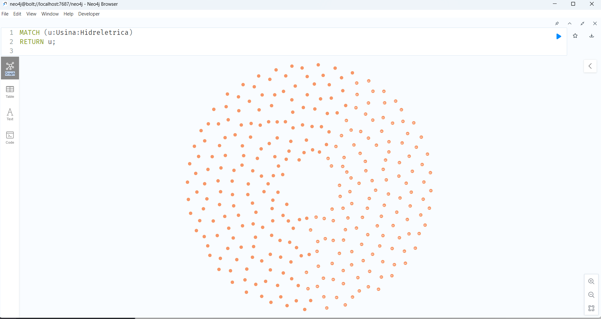
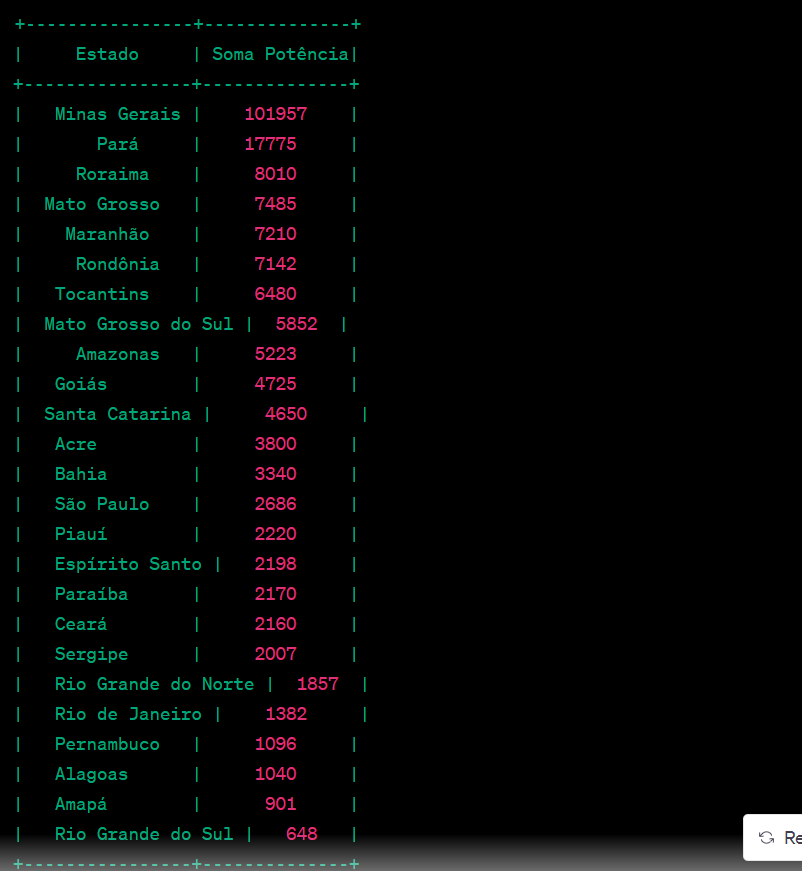

HIDRO - Oracle / PostGreSQL for Neo4J

**Projeto de Gestão de Hidrelétricas Brasileiras usando Neo4j**

O setor de energia é de vital importância para qualquer país, e no caso do Brasil, onde a matriz energética é fortemente baseada em fontes renováveis, as usinas hidrelétricas desempenham um papel crucial. Para otimizar a gestão e o entendimento das complexas interconexões entre hidrelétricas, estados, cidades e consumo de energia, um projeto inovador foi desenvolvido utilizando o banco de dados orientado a grafos Neo4j.

**Objetivo do Projeto:**
O objetivo deste projeto é criar um sistema de gerenciamento que permita a visualização, análise e consulta das informações relacionadas às hidrelétricas brasileiras, seus estados, cidades abastecidas e o consumo de energia correspondente. Além disso, o projeto visa migrar dados de sistemas legados baseados em Oracle e PostgreSQL para o Neo4j, aproveitando as vantagens da modelagem de dados baseada em grafos.

**Modelagem de Dados:**
A modelagem de dados do projeto é baseada em grafos, uma abordagem que permite representar relações complexas de maneira intuitiva. Cada hidrelétrica é representada como um nó do tipo "Usina:Hidreletrica", contendo informações como nome, rio, bacia, sub-bacia, estado, potência instalada, início de operação, proprietário e observação. 

As relações entre os nós são estabelecidas para representar conexões como a geração de energia e o abastecimento de cidades. Essas relações fornecem insights sobre como cada hidrelétrica contribui para o fornecimento de energia e para as áreas urbanas.

**Fluxo do Projeto:**
1. **Extração e Transformação de Dados:** Dados de hidrelétricas, estados, cidades e consumo de energia são extraídos dos sistemas Oracle e PostgreSQL e transformados em um formato adequado para importação no Neo4j.

2. **Importação de Dados para o Neo4j:** Os dados transformados são importados para o Neo4j, criando nós para hidrelétricas e estabelecendo relações entre eles.

3. **Consultas e Análises:** Com os dados no Neo4j, é possível realizar consultas avançadas para responder a perguntas como:
   - Quais cidades são abastecidas pela Usina Hidrelétrica Belo Monte?
   - Quais são as hidrelétricas localizadas no estado do Pará?
   - Qual é o consumo de energia total das usinas hidrelétricas em uma determinada bacia?

**Vantagens do Neo4j:**
O uso do Neo4j traz diversas vantagens para esse projeto:
- **Modelagem Intuitiva:** A modelagem baseada em grafos espelha as relações do mundo real de forma natural.
- **Consultas Eficientes:** O Neo4j é otimizado para consultas de relacionamento, permitindo análises rápidas mesmo em grandes conjuntos de dados.
- **Flexibilidade:** O modelo de dados pode ser facilmente adaptado para acomodar mudanças futuras nas informações.

**Conclusão:**
O projeto de gestão de hidrelétricas brasileiras usando o Neo4j oferece uma abordagem inovadora para compreender as complexas conexões dentro do setor de energia. Ao migrar dados dos sistemas legados para um banco de dados de grafos, é possível obter insights valiosos e tomar decisões mais informadas sobre o fornecimento de energia e sua distribuição pelo território brasileiro. Isso não só otimiza a gestão do setor energético, mas também contribui para um uso mais eficiente e sustentável dos recursos hídricos do país.

# Data Set 2
https://dadosabertos.aneel.gov.br/dataset/6d90b77c-c5f5-4d81-bdec-7bc619494bb9/resource/11ec447d-698d-4ab8-977f-b424d5deee6a/download/siga-empreendimentos-geracao.csv

DatGeracaoConjuntoDados: Data de geração do conjunto de dados (aparentemente a mesma para todas as linhas).

NomEmpreendimento: Nome do empreendimento de geração de energia.

IdeNucleoCEG: Identificador do núcleo de Central Geradora de Energia.

CodCEG: Código da Central Geradora de Energia.

SigUFPrincipal: Sigla da unidade federativa principal onde o empreendimento está localizado.

SigTipoGeracao: Sigla do tipo de geração de energia (PCH para Pequena Central Hidrelétrica, UHE para Usina Hidrelétrica, CGH para Central Geradora Hidrelétrica, UTE para Usina Termelétrica, etc.).

DscFaseUsina: Descrição da fase de operação da usina (por exemplo, "Operação").

DscOrigemCombustivel: Descrição da origem do combustível utilizado (por exemplo, "Hídrica" para usinas hidrelétricas).

DscFonteCombustivel: Descrição da fonte do combustível (por exemplo, "Potencial hidráulico").

DscTipoOutorga: Descrição do tipo de outorga concedida para a operação do empreendimento (por exemplo, "Autorização").

NomFonteCombustivel: Nome da fonte do combustível (por exemplo, "Potencial hidráulico").

DatEntradaOperacao: Data de entrada em operação do empreendimento.

MdaPotenciaOutorgadaKw: Mediana da potência outorgada em quilowatts.

MdaPotenciaFiscalizadaKw: Mediana da potência fiscalizada em quilowatts.

MdaGarantiaFisicaKw: Mediana da garantia física em quilowatts.

IdcGeracaoQualificada: Indicador de geração qualificada (por exemplo, "Não").

NumCoordNEmpreendimento: Número da coordenada norte do empreendimento.

NumCoordEEmpreendimento: Número da coordenada leste do empreendimento.

DatInicioVigencia: Data de início da vigência.

DatFimVigencia: Data de término da vigência.

DscPropriRegimePariticipacao: Descrição da propriedade ou regime de participação do empreendimento (por exemplo, "100% para ANGLOGOLD ASHANTI CÓRREGO DO SÍTIO MINERAÇÃO S.A.").

DscSubBacia: Descrição da sub-bacia hidrográfica onde o empreendimento está localizado.

DscMuninicpios: Descrição dos municípios onde o empreendimento está localizado.

CONSULTAS:

MATCH (u:Usina)
WHERE u.estado = 'São Paulo'
WITH u, TOINTEGER(REPLACE(u.potencia_instalada, ' MW', '')) AS potencia
RETURN SUM(potencia) AS somaPotencia;

MATCH (u:Usina:Hidreletrica)
WITH u.estado AS estado, TOINTEGER(REPLACE(u.potencia_instalada, ' MW', '')) AS potencia
RETURN estado, SUM(potencia) AS somaPotencia
ORDER BY somaPotencia DESC;

hYK3S2NtcuS7